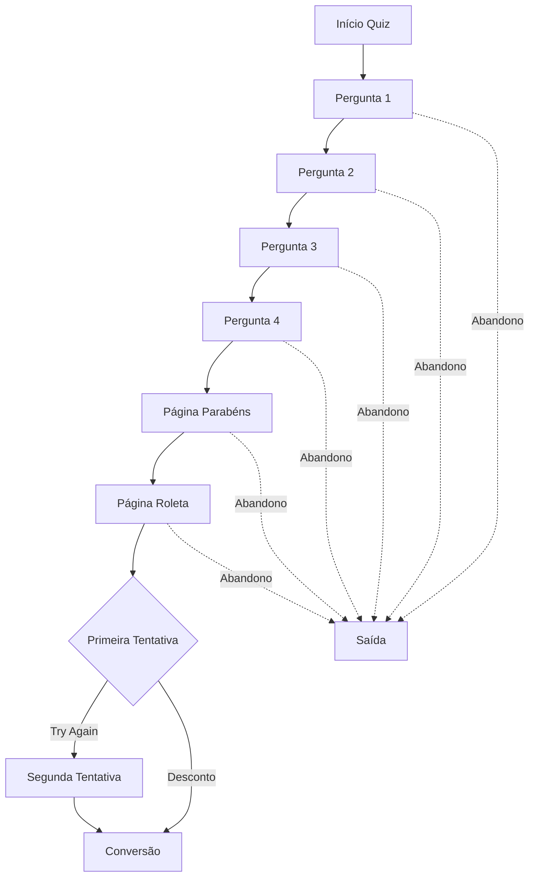

# 📊 Documentação de Eventos de Tracking - Quiz Amazon Prime Day

## 🎯 Visão Geral

Este documento detalha todos os eventos de tracking implementados no Quiz Amazon Prime Day para análise completa de retenção e conversão do usuário. Os eventos são enviados tanto para **Facebook Pixel** quanto para **UTMify** com nomenclatura clara em português.

---

## 📋 Estrutura dos Eventos

Todos os eventos seguem a estrutura:
```javascript
{
  content_name: "Nome descritivo do evento",
  content_category: "categoria_do_evento", 
  etapa_funil: "etapa_especifica",
  // ... outros parâmetros específicos
}
```

---

## 🎪 1. EVENTOS DE RETENÇÃO POR PÁGINA

### `pergunta_visualizada`
**Disparado quando:** Usuário visualiza cada pergunta (1-4)
```javascript
{
  content_name: "Pergunta X Visualizada",
  content_category: "retencao_quiz",
  pergunta_numero: 1-4,
  progresso_percentual: 25, 50, 75, 100,
  etapa_funil: "pergunta_1" | "pergunta_2" | "pergunta_3" | "pergunta_4",
  tipo_interacao: "visualizacao"
}
```

### `pagina_parabens_visualizada` 
**Disparado quando:** Usuário chega na página de congratulações
```javascript
{
  content_name: "Página de Parabéns Visualizada",
  content_category: "retencao_quiz",
  etapa_funil: "quiz_completo",
  tipo_pagina: "congratulacoes",
  momento_jornada: "pos_quiz"
}
```

### `pagina_roleta_visualizada`
**Disparado quando:** Usuário chega na página da roleta
```javascript
{
  content_name: "Página da Roleta Visualizada", 
  content_category: "retencao_quiz",
  etapa_funil: "pre_conversao",
  tipo_pagina: "roleta",
  momento_jornada: "engajamento"
}
```

### `pagina_visualizada`
**Disparado quando:** Usuário sai de qualquer página (tracking de tempo)
```javascript
{
  content_name: "Página X Visualizada",
  content_category: "navegacao_quiz",
  pagina_numero: 1-6,
  tipo_pagina: "pergunta" | "parabens" | "roleta",
  tempo_na_pagina_segundos: 45.2,
  etapa_funil: "pagina_X",
  momento_jornada: "navegacao"
}
```

---

## 📈 2. EVENTOS DE PROGRESSÃO NO FUNIL

### `progresso_funil`
**Disparado quando:** Usuário avança para nova página
```javascript
{
  content_name: "Progresso no Funil: X%",
  content_category: "analise_retencao", 
  etapa_atual: 1-6,
  total_etapas: 6,
  porcentagem_progresso: 17, 33, 50, 67, 83, 100,
  etapa_funil: "progresso_X_porcento",
  status_retencao: "alta_retencao" | "media_retencao" | "baixa_retencao"
}
```
**Classificação:**
- `alta_retencao`: ≥75% de progresso
- `media_retencao`: 50-74% de progresso  
- `baixa_retencao`: <50% de progresso

### `quiz_avancar_pergunta`
**Disparado quando:** Usuário avança entre perguntas (1→2, 2→3, 3→4)
```javascript
{
  content_name: "Avançou da Pergunta X para Y",
  content_category: "quiz_navegacao",
  de_pergunta: 1-4,
  para_pergunta: 1-4, 
  progresso_percentual: 25, 50, 75, 100,
  etapa_funil: "progressao_quiz"
}
```

---

## 🎯 3. EVENTOS DE INTERAÇÃO COM PERGUNTAS

### `quiz_pergunta_respondida`
**Disparado quando:** Usuário seleciona uma resposta
```javascript
{
  content_name: "Pergunta X Respondida",
  content_category: "quiz_interacao",
  pergunta_numero: 1-4,
  pergunta_texto: "Do you know what Amazon Prime Day is?",
  resposta_selecionada: "Yes, of course! I look forward to it every year",
  etapa_funil: "coleta_dados"
}
```

### `quiz_finalizado`
**Disparado quando:** Usuário completa todas as 4 perguntas
```javascript
{
  content_name: "Quiz Totalmente Finalizado",
  content_category: "quiz_conclusao", 
  total_respostas: 4,
  respostas_completas: ["resposta1", "resposta2", "resposta3", "resposta4"],
  etapa_funil: "quiz_concluido"
}
```

---

## 🎰 4. EVENTOS DA ROLETA

### `roleta_visualizada`
**Disparado quando:** Usuário chega na roleta
```javascript
{
  content_name: "Usuário Chegou na Roleta",
  content_category: "roleta_acesso",
  etapa_funil: "pre_conversao", 
  momento_jornada: "pos_quiz"
}
```

### `roleta_primeira_tentativa`
**Disparado quando:** Usuário gira a roleta pela primeira vez
```javascript
{
  content_name: "Primeira Girada da Roleta",
  content_category: "roleta_interacao",
  tentativa_numero: 1,
  etapa_funil: "engajamento_inicial"
}
```

### `roleta_segunda_tentativa`
**Disparado quando:** Usuário gira a roleta pela segunda vez
```javascript
{
  content_name: "Segunda Girada da Roleta", 
  content_category: "roleta_interacao",
  tentativa_numero: 2,
  etapa_funil: "engajamento_conversao"
}
```

### `roleta_try_again`
**Disparado quando:** Roleta resulta em "Try Again"
```javascript
{
  content_name: "Resultado Try Again na Roleta",
  content_category: "roleta_resultado",
  resultado_tipo: "try_again",
  etapa_funil: "primeira_tentativa"
}
```

### `roleta_desconto_ganho`
**Disparado quando:** Usuário ganha um desconto
```javascript
{
  content_name: "Desconto Conquistado: 75% OFF",
  content_category: "roleta_resultado",
  desconto_valor: "75% OFF",
  resultado_tipo: "desconto_ganho", 
  etapa_funil: "conversao_sucesso"
}
```

---

## 💰 5. EVENTOS DE CONVERSÃO

### `jornada_finalizada`
**Disparado quando:** Usuário clica para ir para Amazon
```javascript
{
  content_name: "Clique Final para Amazon",
  content_category: "conversao_final",
  desconto_aplicado: "75% OFF" | "nenhum",
  etapa_funil: "conversao_concluida",
  momento_jornada: "clique_final"
}
```

### `jornada_100_completa`
**Disparado quando:** Jornada completa (quiz → roleta → conversão)
```javascript
{
  content_name: "Jornada Completa do Quiz à Conversão", 
  content_category: "jornada_sucesso",
  tempo_total_segundos: 127.5,
  desconto_final: "75% OFF" | "nenhum",
  etapa_funil: "jornada_finalizada",
  status_conversao: "sucesso"
}
```

---

## ⚠️ 6. EVENTOS DE ABANDONO

### `abandono_detectado`
**Disparado quando:** Usuário sai/fecha navegador
```javascript
{
  content_name: "Abandono na Página X",
  content_category: "retencao_negativa",
  pagina_numero: 1-6,
  tipo_pagina: "pergunta" | "parabens" | "roleta",
  tempo_antes_abandono: 23.4,
  etapa_funil: "abandono_pagina_X",
  motivo_possivel: "saida_navegador"
}
```

---

## 📊 7. MÉTRICAS DE ANÁLISE RECOMENDADAS

### 🎯 **Taxa de Retenção por Etapa**
```sql
-- Exemplo de cálculo de retenção
Taxa_Retencao_Pergunta_2 = 
  COUNT(pergunta_visualizada WHERE pergunta_numero = 2) / 
  COUNT(pergunta_visualizada WHERE pergunta_numero = 1) * 100
```

### ⏱️ **Tempo Médio por Página**
```sql
-- Tempo médio gasto em cada pergunta
SELECT 
  pagina_numero,
  AVG(tempo_na_pagina_segundos) as tempo_medio,
  COUNT(*) as total_visualizacoes
FROM pagina_visualizada 
GROUP BY pagina_numero
```

### 🎰 **Efetividade da Roleta**
```sql
-- Taxa de conversão da roleta
Taxa_Conversao_Roleta = 
  COUNT(jornada_finalizada) / 
  COUNT(pagina_roleta_visualizada) * 100
```

### 📉 **Pontos Críticos de Abandono**
```sql
-- Páginas com maior abandono
SELECT 
  pagina_numero,
  COUNT(*) as abandonos,
  AVG(tempo_antes_abandono) as tempo_medio_antes_abandono
FROM abandono_detectado 
GROUP BY pagina_numero 
ORDER BY abandonos DESC
```

---

## 🎪 8. FUNIL DE CONVERSÃO COMPLETO



---

## 🔧 9. IMPLEMENTAÇÃO TÉCNICA

### **Facebook Pixel**
Eventos enviados como:
```javascript
fbq('track', 'nome_do_evento', dados_do_evento)
```

### **UTMify**
Eventos enviados como:
```javascript
utmify.track('nome_do_evento', dados_do_evento)
```

### **Console Debug**
Todos os eventos são logados no console para debug:
```javascript
console.log('📊 Tracking Event:', eventName, data)
```

---

## 🎯 10. DASHBOARD SUGERIDO

### **KPIs Principais:**
1. **Taxa de Completação do Quiz:** % que chega na página de parabéns
2. **Taxa de Engajamento da Roleta:** % que gira pelo menos uma vez
3. **Taxa de Conversão Final:** % que clica para Amazon
4. **Tempo Médio de Jornada:** Segundos do início à conversão
5. **Pontos de Abandono:** Onde mais usuários saem

### **Segmentações Úteis:**
- Por fonte de tráfego (UTM)
- Por dispositivo (mobile/desktop)
- Por hora do dia
- Por resultado da roleta
- Por tempo gasto em cada etapa

---

## 🚀 Próximos Passos

1. **Configure dashboards** no Facebook Analytics ou ferramenta de BI
2. **Estabeleça benchmarks** para cada métrica
3. **Monitore pontos de abandono** críticos
4. **Teste variações** no quiz para melhorar retenção
5. **Analise correlações** entre tempo gasto e conversão

---

*Documentação criada em: Janeiro 2025*  
*Sistema: Quiz Amazon Prime Day v1.0*  
*Tracking: Facebook Pixel + UTMify* 